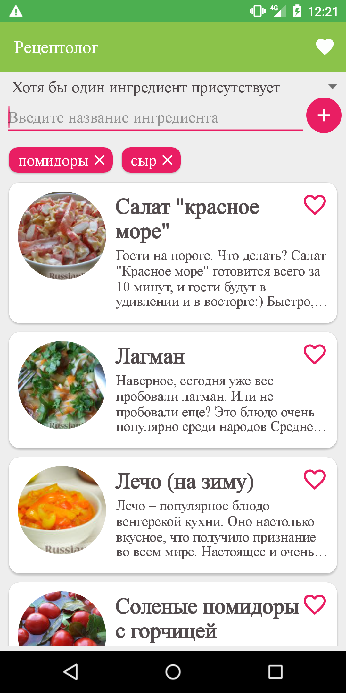
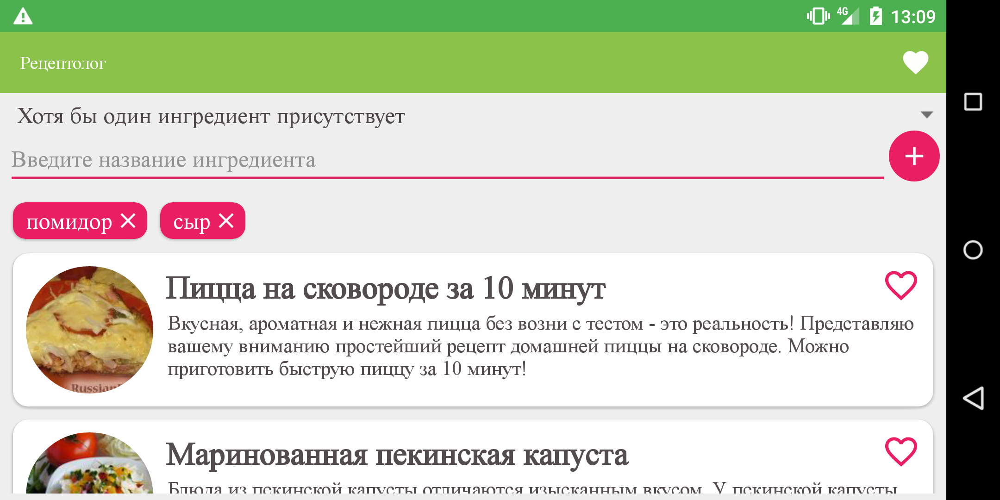

Приложение по подборке рецептов по ингредиентам
===============================================
Цель приложения помочь домохозяйкам не искать долго рецепты и думать о том,
как бы все продукты были дома. Это приложение помогает лучше узнать свой холодильник .

Ограничения API:
----------------
* Если сервер заснет, то будет очень долго просыпаться

Ключевые слова:
---------------

Возможности приложения:
-----------------------
Пользователь может подобрать блюда для себя по нескольким параметрам:
* по названию рецепта,
* по ингредиентам, где все ингредиенты будут присутствовать в рецепте,
* по ингредиентам, где хотя бы один ингредиент будет присутствовать в рецепте.

Также пользователь может добавить блюда в избранный, что позволит ему
быстро их находить и пользоваться ими даже тогда, когда нет доступа
в интернет.

Реализовано три экрана:
-----------------------
* Главный экран

* Экран с рецептами

* Экран с любимыми рецептами

* 
Также для главного экрана реализован поворот экранов с сохранением состояния:
------------------------------------------------------------------------------------------
* Главный экран

У пользователя есть возможность добавлять рецепты в избранные:
--------------------------------------------------------------

Обработка потери связи с интернетом обработана таким образом:
-------------------------------------------------------------
