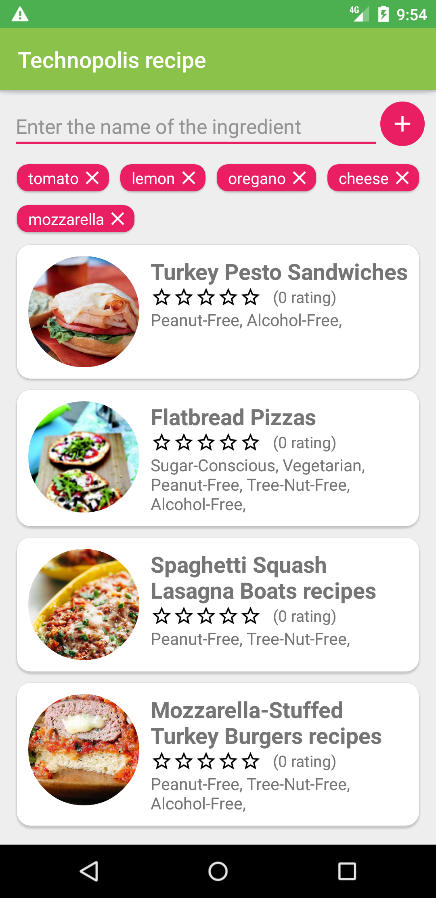
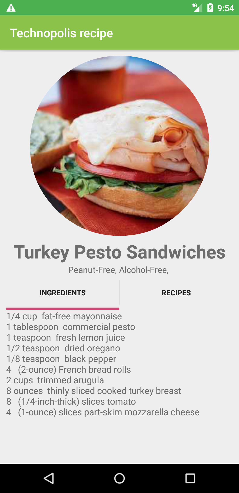
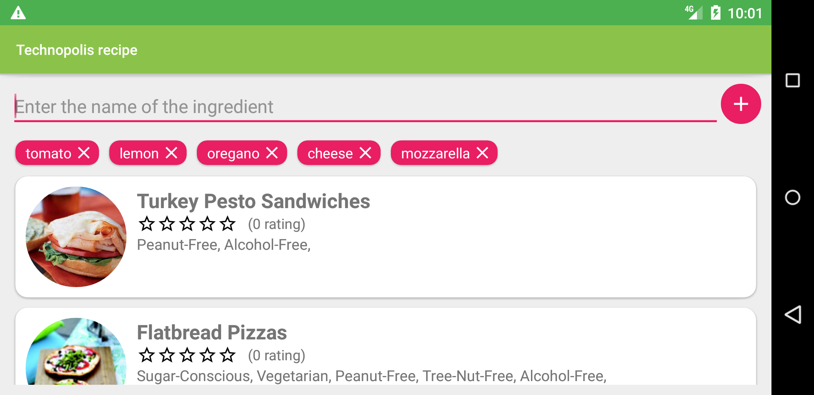
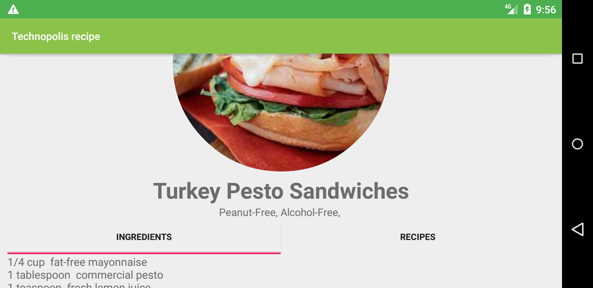

<h1> Приложение по подборке рецептов по ингредиентам </h1> 

  Цель приложения помочь домохозяйкам не искать долго рецепты и думать о том, как бы все продукиты были дома. Это приложение помогает узнать свой холодильник подробнее. 

<h2> Ограничения API: </h2>
<ul>
    <li>5 запросов в минуту</li>
</ul>
<h2> Ключевые слова: </h2>

<h2> Реализовано два экрана: </h2>
 <ul>
    <li>Главный экран</li>
    
    <li>Экран с рецептами</li>
    
  </ul>

<h2> Также реализован поворот экранов с сохранением состояний: </h2>
 <ul>
    <li>Главный экран</li>
    
    <li>Экран с рецептами</li>
    
  </ul>
